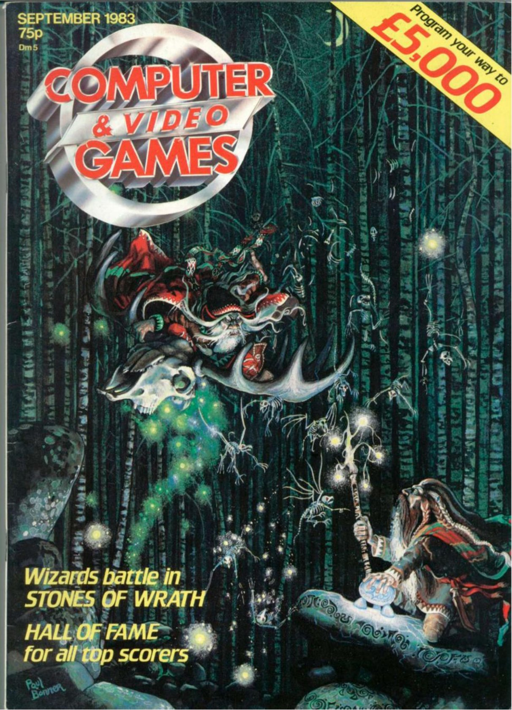
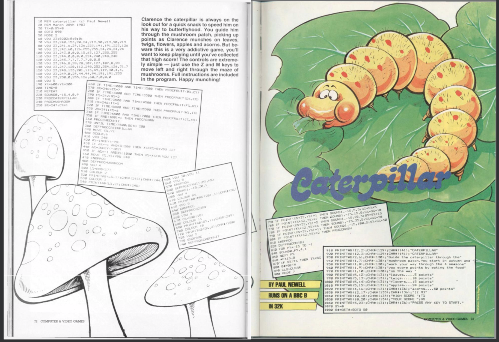
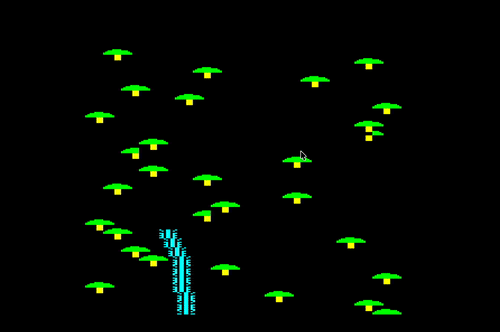
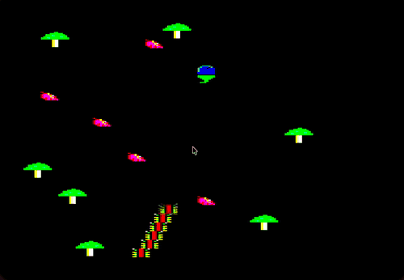

# Caterpillar (BBC Micro)

A type-in BASIC game from 1983, rewritten in native 6502 assembly in 2026 by the same author, 43 years later.

The original was published as a type-in listing in **Computer & Video Games** magazine (issue 23, 1983), This repository is the **2026 rewrite** for the BBC Micro Model B: same game, rebuilt from scratch with multi-colour sprites and a vsync-locked 50Hz engine.

<!-- Scan: magazine cover -->
<p align="center">
  <br>
  <em>Computer &amp; Video Games, issue 23 (1983).</em>
</p>

<!-- Scan: printed listing -->
<p align="center">
  <br>
  <em>The Caterpillar type-in listing as printed. Full-resolution scans live in <a href="./assets/"><code>assets/</code></a>.</em>
</p>

## Play in the browser

No download, no emulator install. Play instantly at:

**https://newell-paul.github.io/caterpillar-assembler/**

The page (`index.html`) embeds [jsbeeb](https://github.com/mattgodbolt/jsbeeb) and boots the
committed `caterpillar.ssd` straight from the repo. Click the emulator, press any key to
start, then **Z** / **M** to move left and right.

## Score to beat

**Will Newell — 3950**

---

## The game

Guide the caterpillar across four seasons, eating fruit and acorns while dodging the
poisonous mushrooms. The original was ~110 lines of BBC BASIC. The rewrite is a hybrid:

- **BASIC (MODE 7)** handles the title screen, menus, and score / game-over screens.
- **6502 assembly (MODE 2)** runs the game engine at 50 Hz: multi-colour sprites, hardware
  scrolling, ring-buffer collision, and the deterministic season cycle.

The two halves talk through a small contract: BASIC calls the engine with `CALL &1900`,
the engine returns a result code and the score in zero page.

The season cycle is fully deterministic, with no system timer, so a given run plays out
identically every time. Difficulty ramps by varying
mushroom density rather than speed.

<!-- Clip: 1983 BASIC original -->
<p align="center">
  <br>
  <em>1983: the original BBC BASIC version. Flat, single-colour blocks drawn with VDU characters.</em>
</p>

<!-- Clip: 2026 assembly rewrite -->
<p align="center">
  <br>
  <em>2026: the native 6502 rewrite. Multi-colour sprites, faster smoother scrolling, the same game 43 years on.</em>
</p>

## Build & run

```bash
make              # assemble caterpillar.ssd
make run          # build, then open it in jsbeeb (localhost)
make clean        # remove the .ssd
```

The build uses [BeebASM](https://github.com/stardot/beebasm) (expected at `./beebasm`).
Load the resulting `caterpillar.ssd` in [jsbeeb](https://bbc.godbolt.org),
[BeebEm](https://www.mkw.me.uk/beebem/), or [b-em](https://www.b-em.bbcmicro.com),
then press **Shift+Break** to boot.

## Files

| File | What it is |
|------|------------|
| `caterpillar.asm` | The 6502 assembly game engine |
| `caterpillar.bas` | The BASIC MODE 7 wrapper (title / menu / scores) |
| `caterpillar.asc` | The original 1983 BASIC listing (reference only, untouched) |
| `caterpillar.ssd` | The built disc image (boot with Shift+Break) |
| `!BOOT` | Disc boot script: loads the engine, then `CHAIN`s the BASIC front-end |
| `Makefile` | Build automation |
| `assets/` | Magazine cover and listing scans |

## The story


The full write-up is in [`43-years-later.md`](./43-years-later.md).

## Provenance

- **Magazine**: *Computer & Video Games*, issue 23 (1983); scans in [`assets/`](./assets/)
- **Original author & rights holder**: Paul Newell
- **BBC Micro Archive**: [bbcmicro.co.uk](https://www.bbcmicro.co.uk/game.php?id=1066)

## Licence

Original 1983 listing © Paul Newell, 1983. The 2026 rewrite is released under the MIT licence; see [`LICENSE`](./LICENSE).
